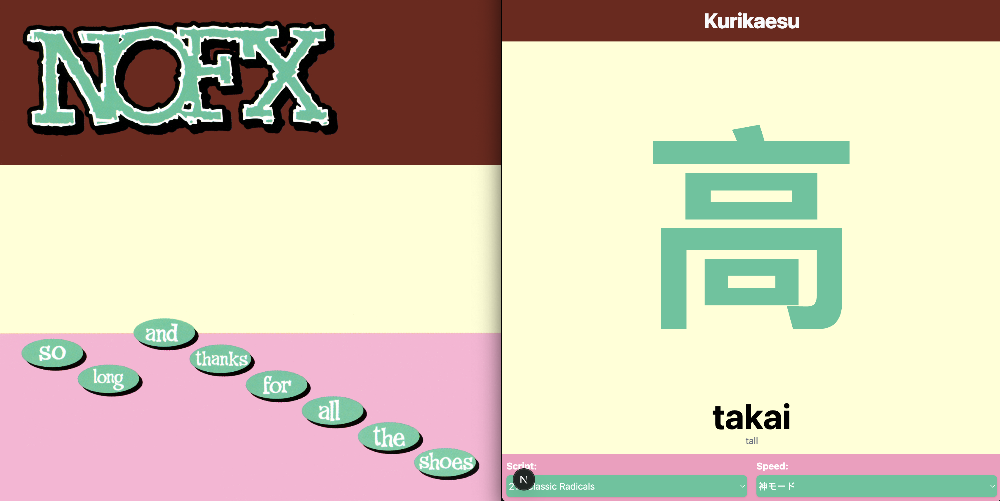

# Kurikaesu (繰り返す)

**Pronunciation:** ku-ri-ka-e-su

**Meaning:** **To repeat**; to do something over again.

## About

Tool to practice Katakana, Hiragana, and 214 Classic Radicals. Run it in a little corner while you do anything else.

[https://kurikaesu.vercel.app](https://kurikaesu.vercel.app)

## Getting Started

To run locally:

```bash
npm run dev
```

## Theme

The colors were inspired by NOFX’s album "So Long and Thanks for All the Shoes."



## License

[](https://opensource.org/licenses/MIT)  
This project is licensed under the [MIT License](https://opensource.org/licenses/MIT).

## Contact

Created by [@jorgedonoso](https://github.com/jorgedonoso) – feel free to reach out!
